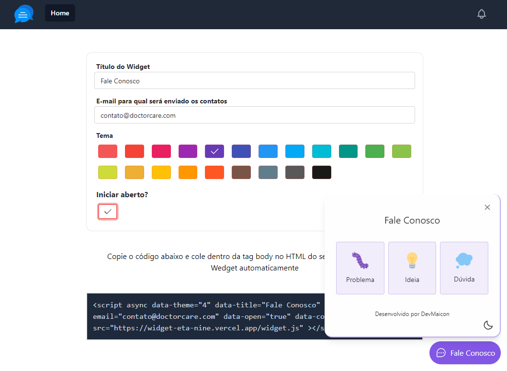

<h1 align="center">Widget Dev</h1>

<p align="center">
  <a href="#-tecnologias">Tecnologias</a>&nbsp;&nbsp;&nbsp;|&nbsp;&nbsp;&nbsp;
  <a href="#-como-executar">Como executar</a>&nbsp;&nbsp;&nbsp;|&nbsp;&nbsp;&nbsp;
  <a href="#-projeto">Projeto</a>&nbsp;&nbsp;&nbsp;|&nbsp;&nbsp;&nbsp;
  <a href="#-layout">Layout Original</a>&nbsp;&nbsp;&nbsp;|&nbsp;&nbsp;&nbsp;
  <a href="#-nextlevel">Próximo Nível</a>&nbsp;&nbsp;&nbsp;|&nbsp;&nbsp;&nbsp;
  <a href="#-license">License</a>&nbsp;&nbsp;&nbsp;|&nbsp;&nbsp;&nbsp;
</p>

<p align="center">
  
</p>

## 🧪 Tecnologias

Esse projeto foi desenvolvido com as seguintes tecnologias:

- [React](https://reactjs.org)
- [Tailwindcss](https://tailwindcss.com)
- [Vite](https://vitejs.dev)
- [TypeScript](https://www.typescriptlang.org)

BACK END

- [Express](https://expressjs.com/pt-br)
- [Prisma](https://www.prisma.io)
- [Jest](https://jestjs.io)

## 🚀 Como executar

Clone o repositório e acesse a pasta.

```bash
$ git clone https://github.com/caslurec/widget

# entrar na pasta do projeto
$ cd widget
```

Para iniciar o BACKEND, siga os passos abaixo:

```bash

# Entrar na pasta back
$ cd back

# Instalar as dependências
$ npm install

# Faça uma copia do arquivo `.env.example` para `.env` e informe suas credenciais

# Criar o banco de dados via migrate
$ npx prisma migrate dev

# Iniciar o projeto
$ npm run dev

```

Para iniciar o FRONT END, siga os passos abaixo:

```bash

# estando na pasta do projeto widget, entre na pasta web
$ cd web

# Instalar as dependências
$ npm install

# Faça uma copia do arquivo `.env.example` para `.env` e informe suas credenciais

# Iniciar o projeto
$ npm run dev

```


A aplicação WEB pode ser acessada em [`localhost:3030`](http://localhost:3030).


## 💻 Projeto

O projeto é uma aplicação para coleta de feedbacks que pode ser adicionado em qualquer ambiente mobile ou web.


## 🔖 Layout

Você pode visualizar o layout do projeto original através do link abaixo:

- [Layout Web](https://www.figma.com/file/xHveOl5sXHMQfXFZ69H1AR/Feedback-Widget)


## 🔖 NextLevel

Abaixo as melhorias que realizei no projeto em relação ao projeto original

- Alterna o tema padrão do Form conforme o tema do navegador do usuário (Dark | Light)
- Novo botão de opção para escolha manual de Tema Dark | Light
- Novo campo e-mail (opcional) para retorno ao remetente quando necessário
- Novo template.html em views/ com para mudança do HTML mais simplificado
- Novo html mais profissional do e-mail - Taxa de 90% de de market support no mailtrap 
- Email SMTP com configuração por .env - Testado e funcionando no mailtrap e mailgun
  
- Opção de personalizar TÍTULO do Widget (Feedback, Fale Conosco, WhatsApp...etc)
- Opção de personalizar a COR do Widget (mais de 20 opções de cores)
- Opção de EMAIL do destinatário no qual será enviado os contatos
- Opção de inserir WhatsApp do destino para linkar com o WhatsApp no final do formulário

- Domínio adquirido https://widgetdev.online
- Email mainGun configurado no domínio - com email funcionando gratuito para usuários do serviço - (até 5.000 e-mails gratuitamente por 3 meses)

- Gerador de um script automático, também criado por mim, para implantar o Feed Widget automaticamente em qualquer site sem precisar copiar ou fazer download de arquivos

```bash

#copie e cole o script abaixo no html de qualquer site e veja o resultado
#escolha o tema de 0 a 20

<script async data-theme="0" data-title="Deixe seu Feedback" data-email="contato@minhaempresa.com" data-open="true" data-code="demo" src="https://widget-eta-nine.vercel.app/widget.js"></script>

```

## 🔖 Exemplos

- [https://widget-eta-nine.vercel.app](https://widget-eta-nine.vercel.app)


## 📝 License

Esse projeto está sob a licença MIT.

---

Feito com 💜 by @caslurec 👋🏻 [Siga-me para acompanhar novos projetos!](https://github.com/caslurec/)
